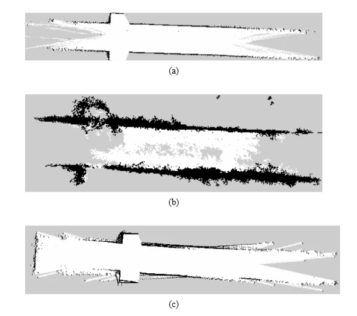
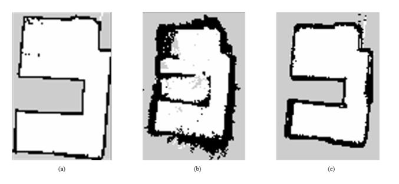
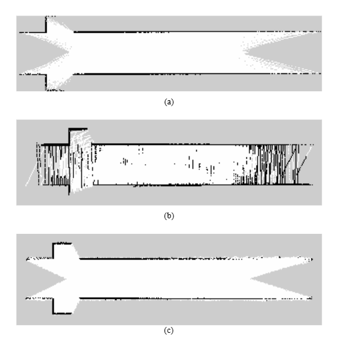
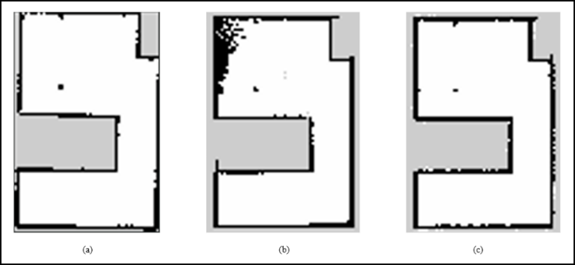
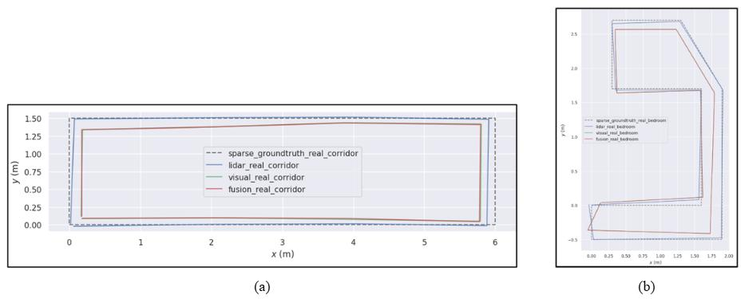
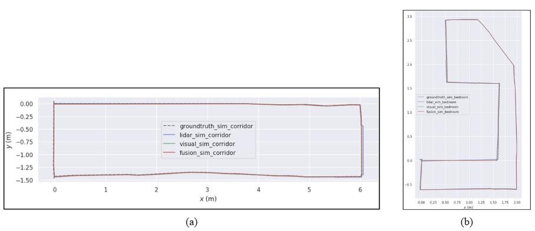

# A Comparative Study: LiDAR, Visual & LiDAR-Visual Fusion SLAM for Low Cost Indoor Mobile Robot

> **Note:** This repository contains my Final Year Project (FYP). It serves as a practical evaluation of different SLAM modalities on a low-cost robotic platform. The full write-up is available as a [Technical Paper (PDF)](docs/paper/G7S2_LIM_JUN_YI_231061481_TechnicalPaper.pdf).

## Overview
As mobile robots increasingly navigate GNSS-denied indoor environments, selecting the optimal Simultaneous Localization and Mapping (SLAM) algorithm is critical. This project evaluates and compares LiDAR-based SLAM, RGB-D Visual SLAM, and LiDAR-Visual Fusion SLAM operating on a custom differential drive robot. 

The study focuses on the real-world performance of consumer-grade sensors, analyzing trajectory accuracy, map quality, and computational resource utilization using a decoupled data-collection and offline-processing architecture.

## System Configuration
### Hardware
The system is divided into an edge data-collection (the robot) and an offline processing (a laptop).
* **Robot Compute (Data Collection):** Raspberry Pi 4B (8GB RAM)
* **Offline Processing (SLAM Execution):** Personal Laptop
* **2D LiDAR:** RPLidar A2M8
* **RGB-D Camera:** Intel RealSense D415
* **IMU:** MPU-6050
* **Motor:** 12V DC Motor
### Software

* ROS 2 Humble
* `slam_toolbox`
* `rtabmap_ros`
* EVO toolkit (trajectory evaluation)
* Foxglove & RViz (visualization)

## Project Workflow
The evaluation is conducted systematically through the following pipeline:
1. **Robot Setup & Sensor Integration:** Assembling hardware, tuning motor PID controllers, setting up sensor fusion (IMU + wheel encoders), and integration of the 2D LiDAR and camera.
2. **Environmental Setup:** Creating physical markers on the floor of the test environment to establish a sparse ground truth coordinate system.
3. **Data Collection:** Teleoperating the robot using the Raspberry Pi 4B to record essential ROS 2 topics into a `rosbag`.
4. **Offline SLAM Execution:** Playing back the `rosbag` on a laptop to run SLAM algorithms deterministically.
5. **Data Conversion:** Extracting the generated robot poses from the `/tf` tree and converting them into the standard TUM format.
6. **Performance Evaluation:** Analyzing the resulting trajectories using the `evo` toolkit, evaluating the 2D occupancy maps in RViz, and profiling computational usage.

## Evaluated SLAM Algorithms
-  **LiDAR SLAM:** [SLAM Toolbox](https://github.com/SteveMacenski/slam_toolbox)
- **Visual SLAM:** [RTAB-Map (RGB-D Mode)](https://github.com/introlab/rtabmap_ros)
- **Fusion SLAM:** RTAB-Map (RGB-D + LiDAR Scan Mode) 

## Sparse Ground Truth Methodology
Since standard indoor environments lack access to GNSS or precise motion capture systems, a Sparse Ground Truth methodology was adopted for trajectory evaluation:
* **Reference Points:** Several reference points are manually marked on the floor of the test environment. Their exact (X, Y) coordinates are measured relative to the robot's starting location using a tape measure.
* **Data Collection Pause:** During teleoperation, the robot is driven to each reference point and kept completely stationary for 5 seconds. This ensures the robot's pose is stable and easily identifiable in the data stream.
* **Timestamp Matching:** Post-experiment, the timestamps corresponding to these 5-second stationary moments are extracted from the recorded trajectories.
* **Evaluation:** The known, measured coordinates are matched with these timestamps to form a sparse ground truth trajectory. Localization accuracy is then evaluated by calculating the Absolute Trajectory Error (ATE) between the SLAM-estimated poses and the measured waypoints.

## Results

Full data collection was completed in two real-world environments (a corridor and a bedroom) and their matching Gazebo simulation counterparts. The same recorded sensor data was replayed offline through all three SLAM approaches to keep the comparison fair.

### Map Quality

**Real-world**

| Environment | LiDAR-Based SLAM | Visual SLAM | LiDAR-Visual Fusion SLAM |
|---|---|---|---|
| Corridor | Excellent | Poor | Good |
| Bedroom | Excellent | Moderate | Good |

**Simulation**

| Environment | LiDAR-Based SLAM | Visual SLAM | LiDAR-Visual Fusion SLAM |
|---|---|---|---|
| Corridor | Excellent | Poor | Good |
| Bedroom | Excellent | Moderate | Excellent |

### Localization Accuracy (ATE RMSE)

**Real-world**

| Environment | LiDAR-Based SLAM | Visual SLAM | LiDAR-Visual Fusion SLAM |
|---|---|---|---|
| Corridor | 6.311 cm | 18.414 cm | 17.986 cm |
| Bedroom | 4.250 cm | 13.503 cm | 13.501 cm |

**Simulation**

| Environment | LiDAR-Based SLAM | Visual SLAM | LiDAR-Visual Fusion SLAM |
|---|---|---|---|
| Corridor | 2.085 cm | 1.354 cm | 1.353 cm |
| Bedroom | 1.192 cm | 1.224 cm | 1.209 cm |

### Generated Maps

**Real-world corridor** — (a) LiDAR SLAM, (b) Visual SLAM, (c) Fusion SLAM

**Real-world bedroom** — (a) LiDAR SLAM, (b) Visual SLAM, (c) Fusion SLAM

**Simulated corridor** — (a) LiDAR SLAM, (b) Visual SLAM, (c) Fusion SLAM

**Simulated bedroom** — (a) LiDAR SLAM, (b) Visual SLAM, (c) Fusion SLAM

### Trajectory Comparison

**Real-world** — (a) Corridor, (b) Bedroom

**Simulation** — (a) Corridor, (b) Bedroom

### Key Takeaways
- **LiDAR-based SLAM** was the most reliable approach in the real world, producing the most geometrically consistent maps and the lowest localization error in both environments.
- **Visual SLAM** struggled in the feature-sparse corridor (largest drift and map distortion) but performed much better in the furnished bedroom, and matched the other approaches once run in simulation — confirming the real-world gap comes from sensing conditions (motion blur, lighting, limited texture), not the algorithm itself.
- **LiDAR-visual fusion SLAM** improved map consistency over Visual SLAM alone but did not beat LiDAR-only localization accuracy, likely due to calibration/synchronization overhead on consumer-grade hardware outweighing the added visual information.
- Across the board, **simulation results were substantially more optimistic** than real-world results, underlining that simulation-only evaluation can overstate practical SLAM performance.

Full methodology, discussion, and references are in the [Technical Paper (PDF)](docs/paper/G7S2_LIM_JUN_YI_231061481_TechnicalPaper.pdf).

## Current Progress
- ✅ Initial system modeling and algorithm testing in Gazebo simulation.
- ✅ Hardware integration, motor PID tuning, and IMU/Encoder sensor fusion.
- ✅ ROS 2 sensor bring-up (RPLidar & RealSense drivers).
- ✅ **Pipeline Validation (Small Test Room):** Successfully collected `rosbag` data (`/tf`, `/odom`, `/scan`, `/camera/...`) to verify hardware reliability.
- ✅ **Pipeline Validation (Small Test Room):** Successfully verified the offline SLAM execution (SLAM Toolbox, RTAB-Map) and `evo` toolkit evaluation workflow on the test data.
- ✅ TF-to-TUM data conversion pipeline fully established.
- ✅ Full data collection using the sparse ground truth method in the real-world and simulation environments (corridor + bedroom).
- ✅ Final benchmarking: ATE evaluation and qualitative map comparison across all three SLAM approaches.
- ⏳ **Pending:** Evaluation in larger/dynamic environments and higher-precision ground truth (future work).

